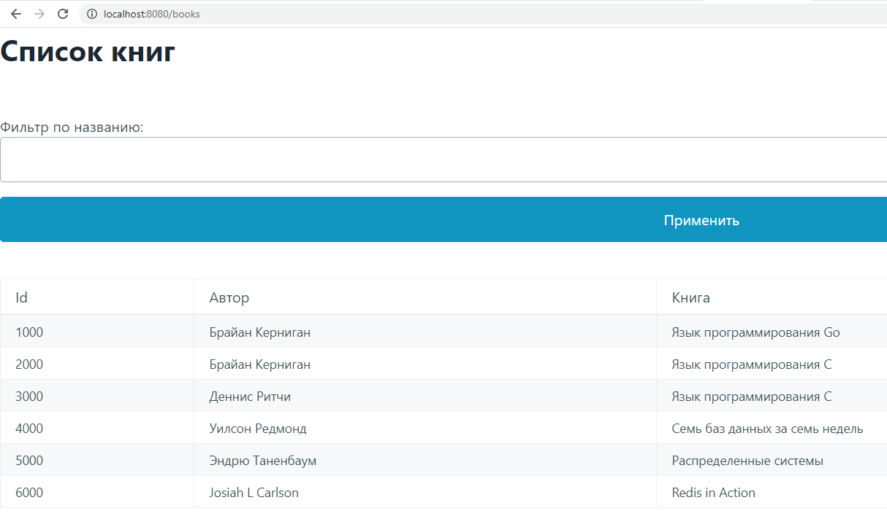
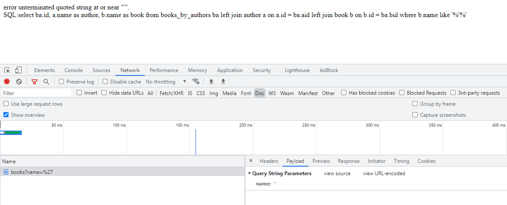
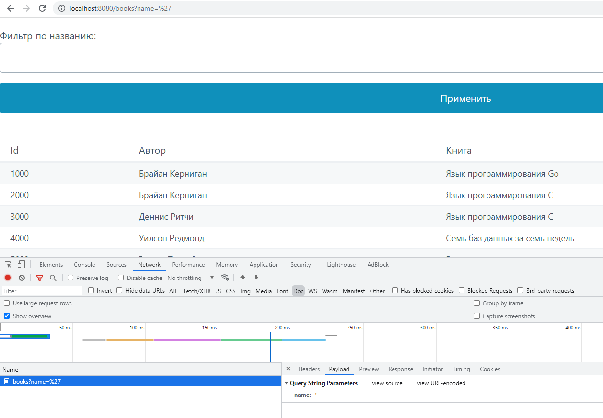
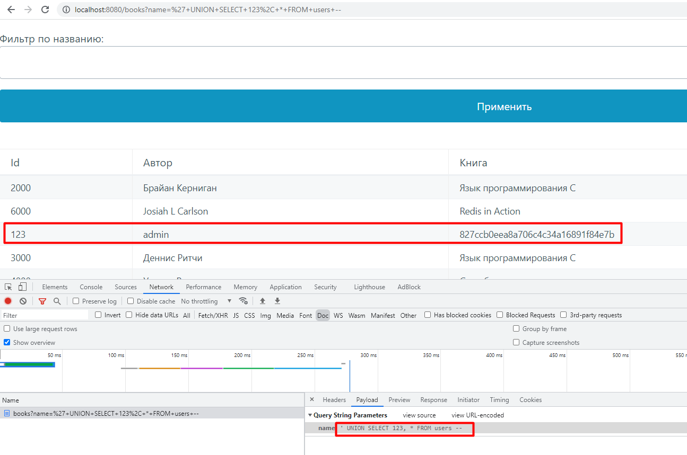
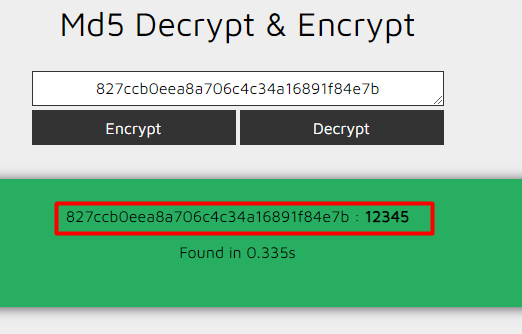
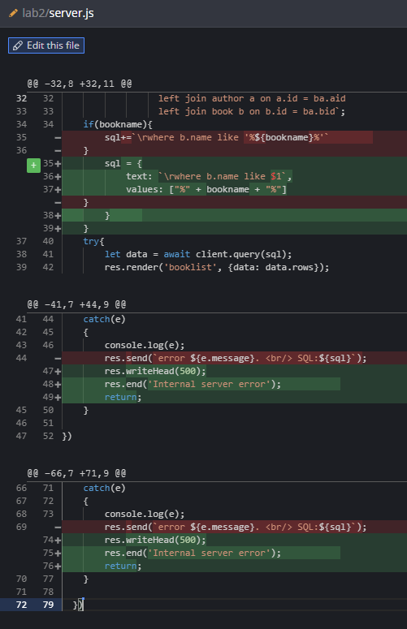
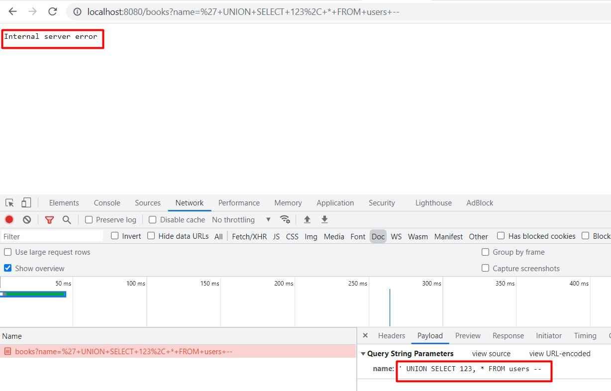
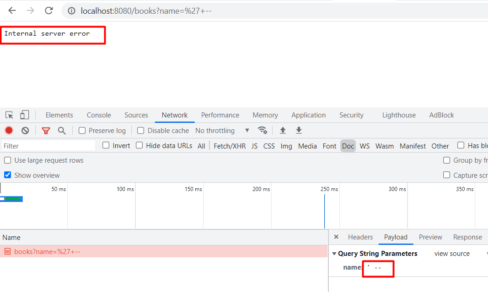

# Отчет по Лабораторной работе №2
> Цель работы: Поиск и устранение SQL Injection.

## Задание 1
1. Войти на сайт и увидеть список книг и авторов

Чтобы авторизоваться на сайте предварительно создадим пользователя в таблице users, в качестве пароля запишем **md5** хеш:


В результате успешной авторизации и редиректа на route **/books** видим список книг и авторов:



2. Обнаружить sql инъекцию

Так как значение фильтра передается в параметре **name** get запроса и подставляется в условие where запроса к БД:
``` where b.name like 'name' ```

Мы можем передать символ **'** как значение фильтра name, чтобы нарушить синтаксис запроса.
Тогда в ответ получим сообщение об ошибке с телом запроса:

```error unterminated quoted string at or near "'". SQL:select ba.id, a.name as author, b.name as book from books_by_authors ba left join author a on a.id = ba.aid left join book b on b.id = ba.bid where b.name like '%'%'```



2.1. Обход установленного фильтра

Мы можем передать **'--** , чтобы создать комментарий из последовательности символов, начинающейся с двойного тире. Так мы экранируем последний апостроф. А значения будут фильтроваться по пустой строке.



2.2. Получение данных из другой таблицы, с одновременным похищением паролей из таблицы **users**

Значение параметра запроса:
```' UNION SELECT 123, * FROM users --```



2.3. Похищение пароля пользователя

Остается только получить обратное значение по хешу. 
Строго говоря, входное значение md5 может быть любой длины, а выходное всегда 128 бит. Это означает, что md5 не является инъективной функцией. Но нам повезло:



3. Исправить уязвимость

Добавим параметризацию запроса, а также при возникновении ошибки не будем отдавать на фронт текст SQL запроса:



В результате уязвимость больше не эксплуатируется.
На фронт возвращается 500 код ошибки:






