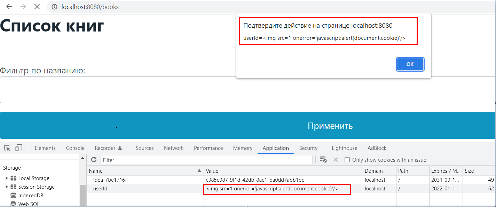
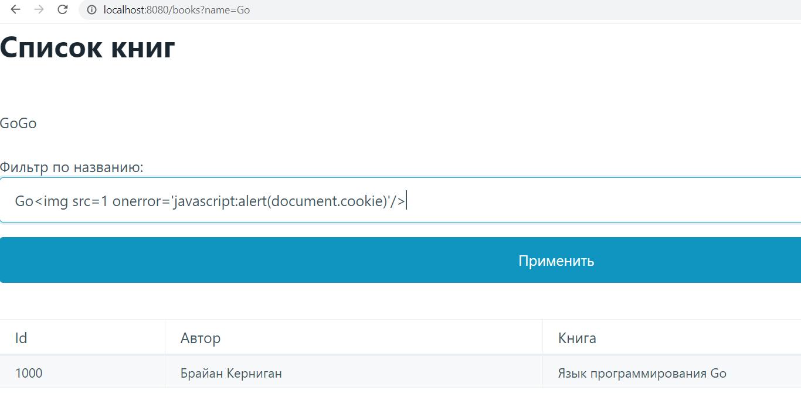

# Отчет по Лабораторной работе №3
> Цель работы: Поиск и устранение XSS уязвимостей.

### 1. Войти на сайт и увидеть список книг и авторов

Чтобы авторизоваться на сайте предварительно создадим пользователя в таблице users, в качестве пароля запишем **md5** хеш:


В результате успешной авторизации и редиректа на route **/books** видим список книг и авторов:


### 2. На странице со списком книг найти
#### 2.1 Reflected XSS в поиске книг


#### 2.2 Persisted (Stored) XSS при создании книги

 XSS")
 XSS")

#### 2.3 Потенциальную уязвимость через Cookie Injection

```span(id='lblUser')``` отображает значение ```cookie``` ```userId```
Изменим его:



#### 2.4 Session hijacking

Похищение cookie любым из 3-х способов приведет к захвату сессии


### 3. Исправить уязвимости

#### 3.1 Persisted (Stored) XSS

В шаблонизаторе pug добавим экранирование ```td #{book.book}```. Чтобы внедренный JS не интерпретировался браузером:

 XSS")

#### 3.2 Reflected XSS и Cookie Injection

Добавим заголовок Content-Security-Policy в Express. Это гарантирует, что заголовок будет включен в каждый ответ сервера:

```js
app.use(function (req, res, next) {
  res.setHeader(
    'Content-Security-Policy',
    "img-src 'self'; script-src 'self';"
  );
  next();
});
```



Заголовок работает должным образом, и все внешние источники, которые мы включили в страницу, были заблокированы для загрузки:


#### 3.3 Session hijacking

Наши куки используются только для поддержки сеанса, в JavaScript они не нужны, так что устанавим флаг ```HttpOnly``` = ```true```

```js 
res.cookie('userId', userId, {httpOnly: true, maxAge: oneDayToSeconds});
```

Теперь куки не доступны из JavaScript через свойства Document.cookie API


